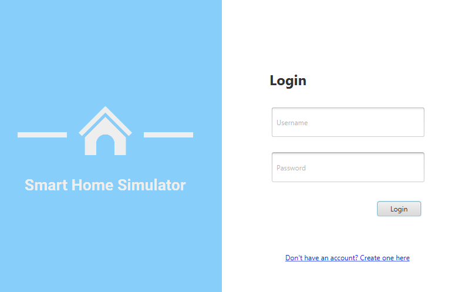
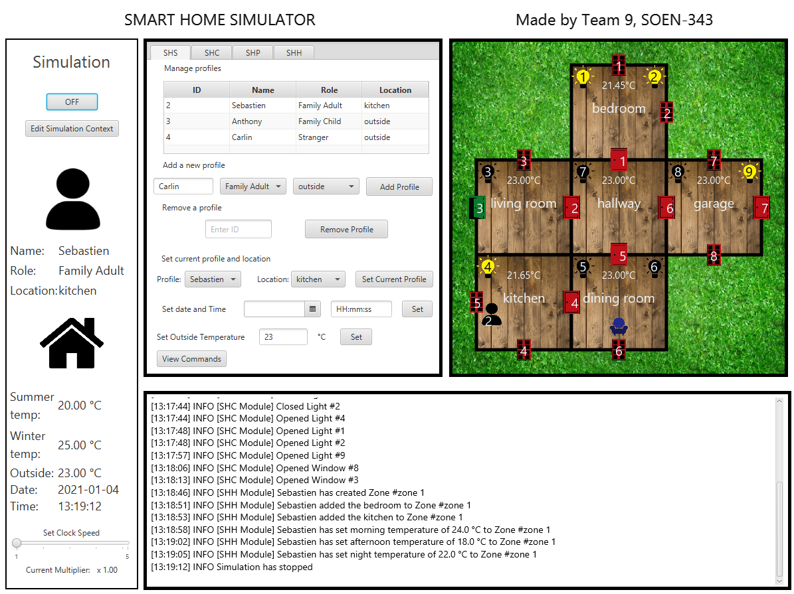
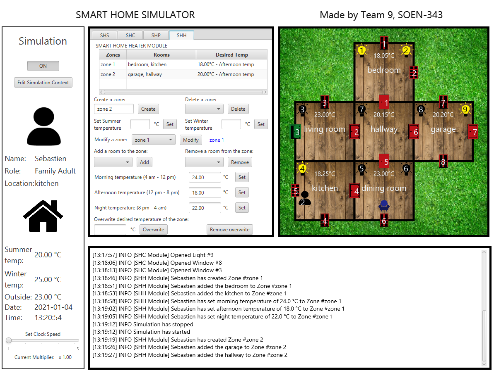

# Smart-Home-Simulator
Smart-Home-Simulator is a desktop Java application that allows users to simulate the environment of a smart home.

Users can open/close doors, windows and lights, place individuals in various rooms, simulate a security scenario and simulate a heating scenario. Moreover, the design of the house is fully customizable by the user through a json file.

## To build Smart-Home-Simulator
Prerequisites:
- [Java SE](https://www.oracle.com/java/technologies/javase-downloads.html) with version above 7 (currently on 15).
- [JavaFX](https://gluonhq.com/products/javafx/) version 11.
- [IntelliJ IDEA](https://www.jetbrains.com/idea/) or any other java IDE (We used IntelliJ IDEA to code)

How-to:
1. Clone the project
2. Open the project in your IDE
3. Open the maven tool and execute the following commands: ``mvm install``, then ``mvm compile`` and run the app with ``javafx:run``
4. This should start the application and from this point you can start the application directly from the run 'App' / Shift+f10 command

### Contributors:
Sébastien Blain-Nadeau - [@Sebastien0730](https://github.com/sebastien-blain)  
Anthony Chraim - [@AnthonyChraim](https://github.com/AnthonyChraim)  
Carlin Lee - [@car12lin12](https://github.com/car12lin12)  
Kelvin Chow Wan Chuen - [@WanProduction](https://github.com/WanProduction)  
Nafisa Shamsuzzaman - [@theNafsters](https://github.com/theNafsters)  

## Screenshots

### Login
 
### Home
 
### Zone control
 
